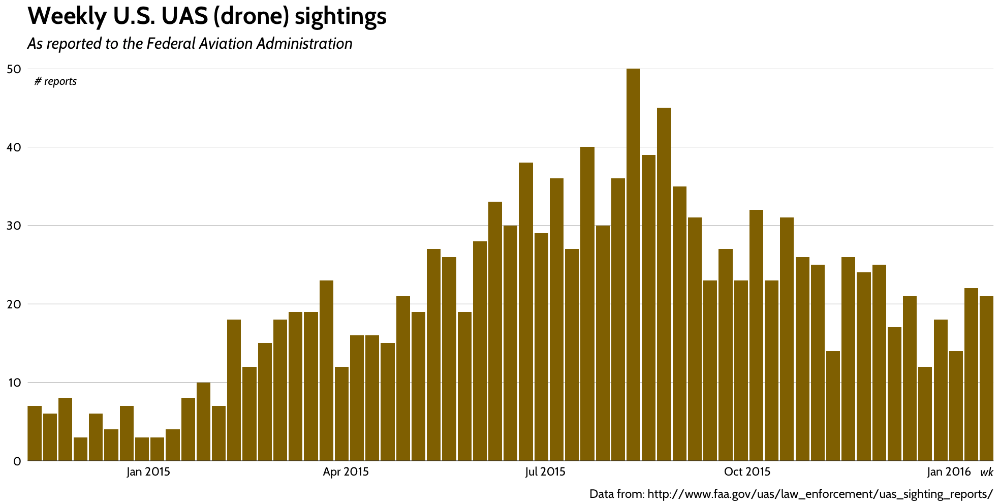

# 52 Vis - 21016 Week 13

FAA UAS data set featured in Data Is Plural and blogged: <a href="https://rud.is/b/2016/03/30/introducing-a-weekly-r-python-js-etc-vis-challenge/">here</a>.

My example R code is here and here's my sample vis

Feel free to do a PR to the repo for you creation. Just make a directory and put your code in there with a sample vis or a screenshot (you may have an interactive vis which requires a run-time environment).

