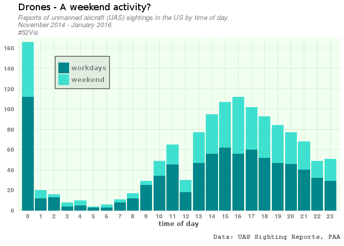

\#52Vis - 2016 Week 13
================
Philipp Ottolinger
5 April 2016

For the first of 52 \#dataviz challenges [@hrbrmstr](https://twitter.com/hrbrmstr) choose a dataset from the US Federal Aviation Association: The [UAS Sighting Reports](https://www.faa.gov/uas/law_enforcement/uas_sighting_reports/) are available as two Excel files covering a timespan from November 2014 to January 2016.

### The data

``` r
Nov2014Aug2015 <- read.csv("~/R/dataviz/UASEventsNov2014-Aug2015.csv")
Aug2015Jan2016 <- read.csv("~/R/dataviz/UAS_Sightings_report_21Aug-31Jan.csv")
```

``` r
head(Nov2014Aug2015, 1)
```

    ##      EventDATETIME LocationCITY LocationSTATE
    ## 1 13.11.2014 15:34  Viginia Key       Florida
    ##                                                                                                                                                                                                                                  EventREPORTNARRATIVE
    ## 1 PRELIM INFO FROM FAA OPS: VIRGINIA KEY, FL/UAS INCIDENT/1534E/MIA TRACON RECEIVED REPORT FROM AMERICAN 397, B737, SJU-MIA, OBSERVED A CYLINDRICAL RED AND SILVER UAS HEADING EASTBOUND AT 8,000 FEET 6 W VIRGINIA KEY, FL. MIAMI DADE PD NOTIFIED. 
    ##   Item.Type                                             Path
    ## 1      Item FocusAreas/AFS/AFS-80/Lists/UAS_Reports_Database

``` r
head(Aug2015Jan2016, 1)
```

    ##      EventDATETIME
    ## 1 31.01.2016 18:17
    ##                                                                                                                                                                                                                                                                                                                                                                                                                                                            EventREPORTNARRATIVE
    ## 1 PRELIM INFO FROM FAA OPS: EDEN PRAIRIE, MN/UAS INCIDENT/1817C/FLYING CLOUD ATCT REPORTED PILOT CIRRUS SR22, OBSERVED A UAS WITH A BLUE LIGHT AT 1,400 FEET 1 MILE N RUNWAY 28R. NOEVASIVE ACTION TAKEN. EDEN PRAIRIE POLICE DEPT NOTIFIED.\n\nMOR Alert for FCM\nType: Public inquiry or concern (including all pilot reported NMACs)\nDate/Time: Jan 31, 2016 - 0017Z\nA/C:  (SR22)\n\nSummary: SR22 REPORTED A UAS ON ABOUT 1.5 TO 2 MILE FINAL 1/2 MILE NORTH OF FINAL. \n
    ##   LocationCITY LocationSTATE
    ## 1 Eden Prairie     Minnesota

The columns `EventREPORTNARRATIVE`, `Item.Type` and `Path` don't seem to be useful for visualization and will therefore be removed from both datasets:

``` r
Nov2014Aug2015$EventREPORTNARRATIVE <- NULL
Nov2014Aug2015$Item.Type <- NULL
Nov2014Aug2015$Path <- NULL
Aug2015Jan2016$EventREPORTNARRATIVE <- NULL
```

Both datasets now contain `EventDATETIME`, `LocationCITY`and `LocationSTATE` and can be simply combined by `rbind()`:

``` r
head(Nov2014Aug2015, 3)
```

    ##      EventDATETIME LocationCITY LocationSTATE
    ## 1 13.11.2014 15:34  Viginia Key       Florida
    ## 2 13.11.2014 16:44    Las Vegas        Nevada
    ## 3 14.11.2014 13:55  Los Angeles    California

``` r
head(Aug2015Jan2016, 3)
```

    ##      EventDATETIME      LocationCITY LocationSTATE
    ## 1 31.01.2016 18:17      Eden Prairie     Minnesota
    ## 2 31.01.2016 17:12      Jacksonville       Florida
    ## 3 31.01.2016 16:10 Westhampton Beach      New York

``` r
sightings <- rbind(Nov2014Aug2015, Aug2015Jan2016)
```

### Possible visualizations

I like plotting data into maps. It would be easy to take `LocationState` and fill the respective areas on a US map according to the counts of UAS sightings or looking up map coordinates using `LocationCITY` in `Rgooglemaps::getGeoCode()` and plot some kind of scale for every city.

That sort of plot would look pretty cool I guess. But I can hardly imagine any kind of *causality* that would make such a plot worthwhile.

So I tend to ignore `LocationCITY`and `LocationSTATE` and will have a closer look at the date and time information given for every UAS sighting.

Unmanned aircrafts or drones, as most of us will simply call them, became a popular toy for young and old. When do people have time for toys? In the afternoons of course, when school is out and work is done. And when do people have even more time for toying? At the weekend of course. Let's see if a plot can confirm this conjecture.

### The plot

``` r
# transform EventDATETIME to POSIXct
sightings$datetime <- as.character(sightings$EventDATETIME)
sightings$datetime <- as.POSIXct(sightings$datetime,  format = "%d.%m.%Y %H:%M")
# "US/Central" timezone seems to be a good compromise for me
sightings$datetime <- as.POSIXct(sightings$datetime, tz="US/Central")

# get the weekdays
sightings$weekdays <- weekdays(sightings$datetime)
# get the time of day
library(lubridate)
sightings$hours <- hour(sightings$datetime)

# create a dummy for the weekend
sightings$weekend <- ifelse(sightings$weekdays %in% c("Samstag", "Sonntag"), 1, 0) # That's German!
sightings$weekend <- as.factor(sightings$weekend)
```

Now it's time to fire up `ggplot2`!

``` r
library(ggplot2)
ggplot(sightings, aes(x = hours, group = weekend, fill = weekend)) + 
  geom_bar() +
  scale_x_continuous(breaks = 0:23, expand = c(0,0.3)) + 
  scale_y_continuous(limits = c(0,170), breaks = seq(0,200,20), expand = c(0,0)) + 
  scale_fill_manual(labels = c("workdays", "weekend"), values = c("turquoise4", "turquoise")) +
  theme(panel.background = element_rect(fill = "honeydew"),
        panel.grid.major = element_line(colour = "darkseagreen", size=0.1),
        panel.grid.minor = element_blank(),
        axis.text.x = element_text(family = "sans", face = "bold", colour = "grey50"),
        axis.text.y = element_text(family = "sans", face = "bold", colour = "grey50"),
        axis.ticks.x = element_blank(),
        axis.ticks.y = element_blank(),
        axis.title.x = element_text(face = "bold", family = "NimbusSan", colour = "grey30", size=9),
        legend.text = element_text(family = "NimbusSan", face = "bold", colour = "grey50"),
        legend.position = c(0.2,0.8),
        legend.background = element_rect(fill = "honeydew2", colour = "grey30"),
        plot.title = element_text(family = "NimbusSan"),
        plot.caption = element_text(family = "mono", face = "bold", colour = "grey30"),
        plot.subtitle = element_text(colour = "grey50", face = "italic"),
        legend.key = element_blank()) +
  labs(x = "time of day", 
       y = NULL, 
       fill = NULL,
       title = "Drones - A weekend activity?",
       subtitle = "Reports of unmanned aircraft (UAS) sightings in the US by time of day.\nNovember 2014 - January 2016.\n#52Vis",
       caption = "\nData: UAS Sighting Reports, FAA")
```


